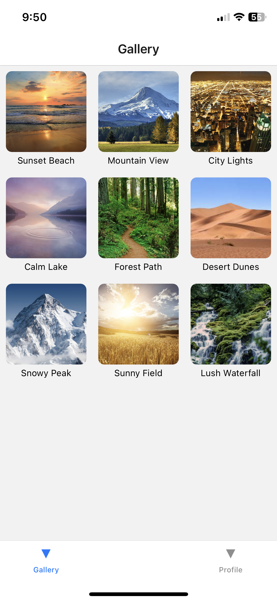
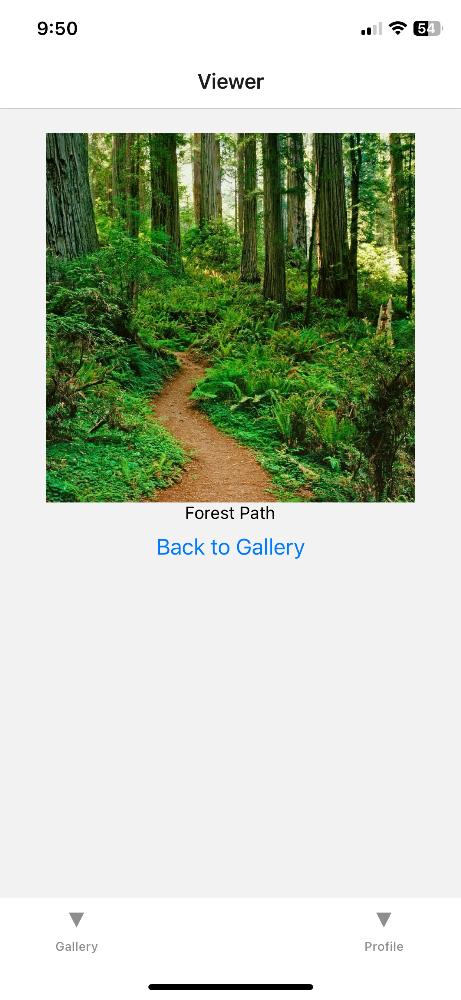
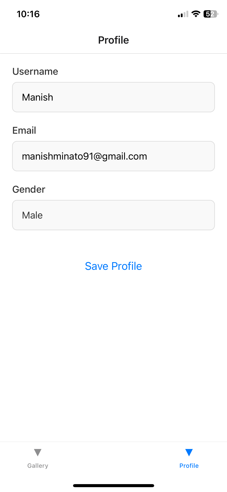
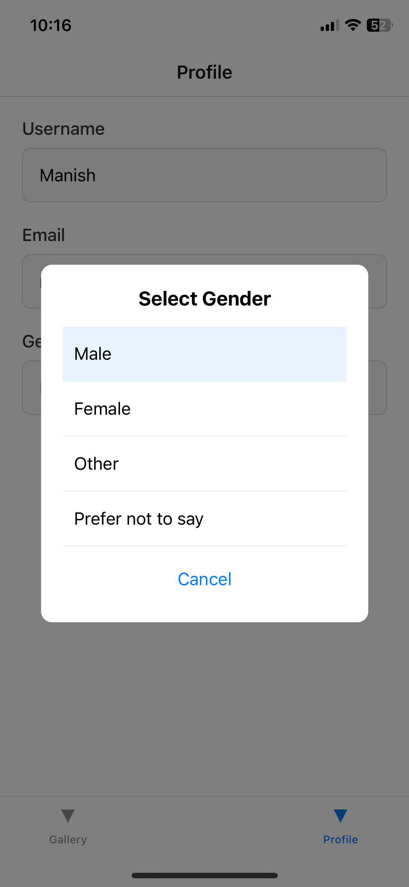
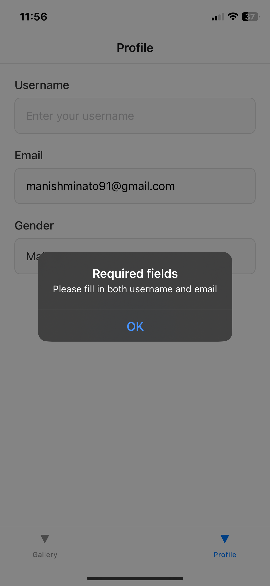

# INFO 670 Assignment 3 - Photo Gallery App

## Design and Purpose

This mobile app allows users to browse a gallery of images, view each in full size, and manage a personalized profile with locally stored information. It's designed to demonstrate multi-screen navigation, custom UI components, and data persistence for mobile apps.

## Features

- **Gallery Screen**: Scroll through a list of images with thumbnails and titles.
- **Picture Viewer**: Tap a photo to see the full version with its caption.
- **Profile Screen**: Edit and save your user profile with custom fields and a gender selection modal.
- **Local Storage**: Persist user data using AsyncStorage.
- **Bottom Tab Navigation**: Easily switch between Gallery, Viewer, and Profile screens.
- **Error Handling**: Prevents saving incomplete or invalid profile data.

## Screenshots

| Gallery | Picture Viewer | Profile | Gender Selection | Error Handling |
|--------|----------------|---------|------------------|----------------|
|  |  |  |  |  |

